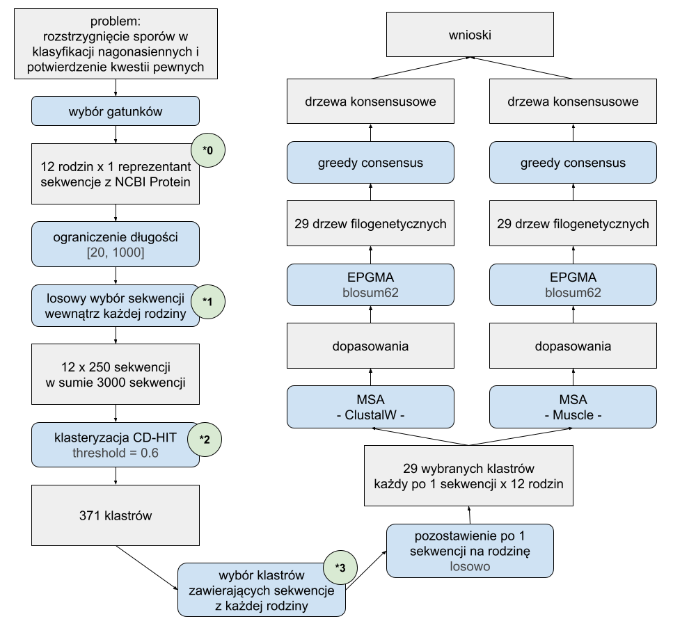
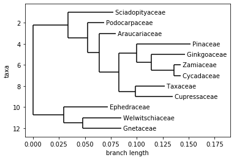
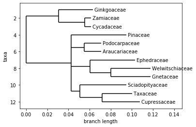
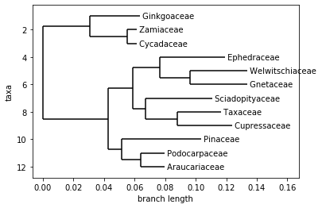

```{r setup, include=FALSE}
#knitr::opts_knit$set(root.dir = rprojroot::find_rstudio_root_file())
knitr::opts_chunk$set(echo = FALSE)
```


# Wstęp

Rośliny nagonasienne (*Gymnospermae*) to grupa roślin charakteryzująca się nie wytwarzaniem otaczających nasiona owoców.
Wraz z siostrzanym kladem roślin okrytonasiennych razem tworzą klad roślin nasiennych. *Gymnospermae* współcześnie reprezentowana jest przez ponad 1000 gatunków. Kiedyś tych gatunków było więcej, jednak podejrzewa się, że konkurencja ze strony roślin okrytonasiennych prowadzi do wymierania gatunków nagonasiennych i spadku różnorodności w tej grupie.


## Problemy filogenetyki roślin nagonasiennych

Filogenetyka nagonasiennych jest ciekawym zagadnieniem ze względu na wciąż trwającą dyskusję nad systematyką wewnątrz grupy. Wciąż pojawiają się inne drzewa filogenetyczne i klasyfikacje w obrębie grupy [@ran_phylogenomics_2018]  [@lu_phylogeny_2014] [@ch_1] [@simpson_plant_2010], pomiędzy którymi istnieją znaczne różnice. 

Podobieństwo między współczesnymi wynikami stanowi odłączanie miłorzębowatych (*Ginkgoaceae*) i sagowcowatych (*Cycadaceae*) jako wcześniejszych grup rozwojowych i wskazywanie sosnowatych (*Pinaceae*) jako bazowej grupy względem gniotowców (*Gnetales*). Na głębszych poziomach drzew ponadto prace drugiego dziesięciolecia XXI wieku zgadzają się co do wielu rzeczy, m.in. zawsze pary araukariowate (*Araucariaceae*) - zastrzalinowate (*Podocarpaceae*), cisowate (*Taxaceae*) - cyprysowate (*Cupressaceae*) oraz welwiczjowate (*Welwitschiaceae*) - gniotowate (*Gnetaceae*) są uważane jako pary siostrzane, a przęślowate (*Ephedraceae*) jako grupa bazalna względem ostatniej z nich (tworzy razem z tą parą gniotowce (*Gnetales*)).

Różnice we współczesnych drzewach filogenetycznych dotyczą umieszczenia grup sosnowatych (*Pinaceae*) (czy są one bazowe względem araukariowców i cyprysowców, czy tylko gniotowców) i sośnicowatych (*Sciadopityaceae*) (czy stanowią one klad bazowy względem araukariowatych i zastrzalinowatych, czy cisowatych i cyprysowatych). 

W przeszłości, przed erą molekularnych badań filogenetycznych, problematyczna była grupa gniotowców (*Gnetales*), która ze względu na swoje cechy fenotypowe dawniej nie była klasyfikowana jako rośliny nagonasienne, a grupa siostrzana do roślin okrytonasiennych.

```{r phyllo_tree_1, out.width="49%", fig.show='hold', fig.align='center', fig.cap="Drzewa filogenetyczne z artykułów (Ran et al. 2018) (po lewej) i (Lu et al. 2014) (po prawej)"}
knitr::include_graphics(c("images/phyllo_tree_1.jpg", "images/phyllo_tree_2.png"))
```


\clearpage

## Cel pracy

Celem pracy jest analiza filogenetyczna roślin nagonasiennych na podstawie sekwencji białkowych 12 gatunków z grupy - po jednym przedstawicielu każdej rodziny. Analiza ma potwierdzić ugruntowane elementy systematyki wewnątrz grupy oraz przedstawić dowody po jednej ze stron w opisanych powyżej kwestiach spornych. 


# Metody

Poniższy diagram (Rysunek 2) przedstawia pipeline którym przeprowadzone było badanie. Cały pipeline, jak i jego poszczególne elementy uruchamiane były kilka razy z różnymi wartościami wskazanych parametrów. Z kolejnych uruchomień zebrano wiedzę pozwalającą udoskonalić przebieg obliczeń. Dokładny opis obliczeń opisany jest w podsekcjach tej sekcji.

```{r pipeline, fig.align='center', fig.cap="Diagram blokowy przedstawiający przebieg badania. Oznaczone na diagramie wartości parametrów to wartości użyte do otrzymania ostatecznych wyników. Zielone kółka stanowią odnośniki, które będą wspominane w dalszej części pracy."}

```


## Wybrane gatunki

Wybrano po 1 przedstawicielu z 12 omawianych rodzin. Zakładając przyjęty podział roślin na rodziny, każdy gatunek jest tu traktowany jako reprezentant swojej rodziny. 

### Sagowiec ...

### Miłorząb dwuklapowy

### Modrzew europejski

### Ephedra sinica

### Gnetum ...

### welwiczjowate coś ? (9)

### Sośnica japońska

### jalowiec pospolity

### cis pospolity

### Araukaria ...

### zastrzalinowate coś? (11)

### to ostatnie

TODO zdjęcia gatunków


## Wybór sekwencji

Z bazy danych NCBI Protein pobrano sekwencje białkowe w formacie FASTA. 

Dla każdego gatunków ograniczono liczbę sekwencji użytych do analizy. Ograniczenie przebiegło w dwóch etapach. W pierwszym odfiltorwano sekwencje spoza zakresu długości `[20, 1000]`. Przeprowadzone wcześniej obliczenia wykazały, że na etapie "*3" nie powstają klastry zawierające sekwencje o długościach spoza tego przedziału. W drugim wybrano losowo po 250 sekwencji każdego gatunku.

W poniższej tabeli znajduje się liczba pobranych sekwencji dla poszczególnych gatunków:

| Lp.  | Rodzina           | Gatunek                    | Pobranych sekwencji | Wybranych sekwencji |
|-----:|:-----------------:|:--------------------------:|:-------------------:|:-------------------:|
| 1    | *Cycadaceae*      | *Cycas revoluta*           | 416                 | 250                 |
| 2    | *Ginkgoaceae*     | *Ginkgo biloba*            | 8384                | 250                 |
| 3    | *Ephedraceae*     | *Ephedra sinica*           | 329                 | 250                 |
| 4    | *Pinaceae*        | *Larix decidua*            | 515                 | 250                 |
| 5    | *Gnetaceae*       | *Gnetum gnemon*            | 517                 | 250                 |
| 6    | *Welwitschiaceae* | *Welwitschia mirabilis*    | 457                 | 250                 |
| 7    | *Sciadopityaceae* | *Sciadopitys verticillata* | 472                 | 250                 |
| 8    | *Cupressaceae*    | *Juniperus communis*       | 381                 | 250                 |
| 9    | *Araucariaceae*   | *Araucaria angustifolia*   | 286                 | 250                 |
| 10   | *Podocarpaceae*   | *Nageia nagi*              | 340                 | 250                 |
| 11   | *Zamiaceae*       | *Zamia furfuracea*         | 383                 | 250                 |
| 12   | *Taxaceae*        | *Taxus baccata*            | 803                 | 250                 |


```{r histograms, out.width="32%", fig.show='hold', fig.align='center', fig.cap="Histogramy i krzywe gęstości długości wybranych sekwencji wewnątrz poszczególnych gatunków (od lewej): Ephedra sinica, Cycas revoluta, Larix decidua. Histogramy pozostałych gatunków bardzo przypominają ten pierwszy."}
knitr::include_graphics(c("images/ephedra_sinica_hist.png", "images/cycas_revoluta_hist.png", "images/larix_decidua_hist.png"))
```


## Klastrowanie sekwencji i wybór klastrów

W kolejnym etapie przeprowadzono klasteryzację zbioru wszystkich wybranych sekwencji z użyciem algorytmu CD-HIT [@cd_hit].
Ustalono następujące wartości parametrów `threshold = 0.6`, `wordsize = 4`. Wybór wartości parametru `threshold` zostanie wyjaśniony w kolejnym paragrafie. Parametr `wordsize` dobierany jest odpowiednio do wartości `threshold`. 
W efekcie działania algorytmu otrzymano 371 klastrów.

Spośród 371 klastrów, wybrano 29, które zawierały co najmniej jedną sekwencję z każdego gatunku. Żaden z klastrów nie zawierał dokładnie jednej sekwencji z każdego gatunku. Sekwencje wewnątrz klastrów nie zawsze były tej samej długości. Parametr `threshold = 0.6` pozwolił otrzymać większą liczbę wybranych klastrów, niż jego większe wartości, które także były testowane `(0.65, 0.7, 0.75, 0.8, 0.85)`.

Wybrane klastry oczyszczono pozostawiając po 1 sekwencji z każdego gatunku. Pozostawiono pierwszą sekwencję z danego gatunku według kolejności w wynikowych plikach programu CD-HIT.

## Dopasowanie sekwencji 

Wewnątrz każdego wybranego klastra przeprowadzono dopasowanie sekwencji. Uliniowienie przeprowadzono równolegle z użyciem dwóch metod: Muscle [@muscle_2004] i ClustalW [@clustal_w]. Oba algorytmy uruchomiono z domyślnym zestawem parametrów.

## Drzewa filogenetyczne

Na podstawie otrzymanych dopasowań, dla każdej kombinacji klastra i algorytmu dopasowania, zbudowano drzewa filogenetyczne. Drzewa zbudowano metodą UPGMA, zatem otrzymane drzewa były ukorzenione. Jako źródło odległości między aminokwasami wykorzystano macierz `BLOSUM62`. Macierz `BLOSUM62` jest domyślną macierzą używaną przez Blast do sekwencji białkowych [@hakeem_malik_vardar-sukan_ozturk_2017], była już w przeszłości używana do badań filogenetycznych w obrębie królestwa roślin [@richardt_lang_reski_frank_rensing_2007] [@turnaev_gunbin_suslov_akberdin_kolchanov_afonnikov_2020].

## Drzewo konsensusowe

Dla obu algorytmów dopasowania zbudowano z drzew filogenetycznych drzewa konsensusowe. Drzewa konsensusowe zbudowano wykorzytując metody decyzyjne greedy consensus (`cutoff < 0.5`) i majority consensus (`cutoff >= 0.5`). Porównano drzewa dla wartości parametru `cutoff` z zakresu `{0, 0.2, 0.4, 0.6, 0.8}`. Dla większych niż `0.2` parametrów `cutoff` grupy siostrzane które powstawały składały się z dużej liczby członków, co oznaczało, że takie drzewa dostarczały mało informacji. Ostatecznie zdecydowano się zaprezentować drzewa dla `cutoff = {0.2, 0}`.

# Wyniki

W tej sekcji zostaną zaprezentowane i omówione drzewa drzewa konsensusowe otrzymane przy użyciu obu wybranych metod MSA.

## ClustalW

```{r sus_clustal, fig.align='center', fig.cap="Drzewo konsensusowe (cutoff = 0.2 i 0 - są identyczne) dla gałęzi pipelinu używającej algorytmu MSA ClustalW."}

```

## Muscle

```{r sus_muscle, fig.align='center', fig.cap="Drzewo konsensusowe (cutoff = 0.2) dla gałęzi pipelinu używającej algorytmu MSA Muscle."}

```


```{r sus_muscle_0, fig.align='center', fig.cap="Drzewo konsensusowe (cutoff = 0) dla gałęzi pipelinu używającej algorytmu MSA Muscle."}

```

# Wnioski i dyskusja

## Propozycje usprawnienia zastosowanej metodologii


# Kod źródłowy

Kod źródłowy użyty do przeprowadzenia obliczeń wraz z wynikami cześciowymi i wykorzystanymi sekwencjami znajduje się na platformie Github pod adresem: [https://github.com/konrad-komisarczyk/Gymnospermae-phylogenetics](https://github.com/konrad-komisarczyk/Gymnospermae-phylogenetics)


# Bibliografia
