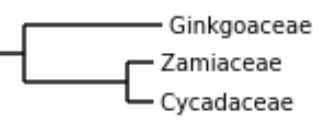

```{r setup, include=FALSE}
#knitr::opts_knit$set(root.dir = rprojroot::find_rstudio_root_file())
knitr::opts_chunk$set(echo = FALSE)
```


# Wstęp

Rośliny nagonasienne (*Gymnospermae*, nagozalążkowe) to grupa roślin charakteryzująca się nie wytwarzaniem otaczających nasiona owoców.
Wraz z siostrzanym kladem roślin okrytonasiennych razem tworzą klad roślin nasiennych. *Gymnospermae* współcześnie reprezentowana jest przez ponad 1000 gatunków. Kiedyś tych gatunków było więcej, jednak podejrzewa się, że konkurencja ze strony roślin okrytonasiennych prowadzi do wymierania gatunków nagonasiennych i spadku różnorodności w tej grupie. Wśród nagozalążkowych wszystkie źródła zgadzają się wydzielając 12 rodzin.


## Problemy filogenetyki roślin nagonasiennych

Filogenetyka nagonasiennych jest ciekawym zagadnieniem ze względu na wciąż trwającą dyskusję nad systematyką wewnątrz grupy. Wciąż pojawiają się inne drzewa filogenetyczne i klasyfikacje w obrębie grupy [@ran_phylogenomics_2018]  [@lu_phylogeny_2014] [@ch_1] [@simpson_plant_2010], pomiędzy którymi istnieją znaczne różnice. 

Podobieństwo między współczesnymi wynikami stanowi odłączanie miłorzębowatych (*Ginkgoaceae*) i sagowcowatych (*Cycadaceae*) jako wcześniejszych grup rozwojowych i wskazywanie sosnowatych (*Pinaceae*) jako bazowej grupy względem gniotowców (*Gnetales*). Na głębszych poziomach drzew ponadto prace drugiego dziesięciolecia XXI wieku zgadzają się co do wielu rzeczy, m.in. zawsze pary araukariowate (*Araucariaceae*) - zastrzalinowate (*Podocarpaceae*), cisowate (*Taxaceae*) - cyprysowate (*Cupressaceae*) oraz welwiczjowate (*Welwitschiaceae*) - gniotowate (*Gnetaceae*) są uważane jako pary siostrzane, a przęślowate (*Ephedraceae*) jako grupa bazalna względem ostatniej z nich (tworzy razem z tą parą gniotowce (*Gnetales*)).

Różnice we współczesnych drzewach filogenetycznych dotyczą umieszczenia grup sosnowatych (*Pinaceae*) (czy są one bazowe względem araukariowców (*Araucariaceae* + *Podocarpaceae*) i cyprysowców (*Cupressaceae* + *Taxaceae*), czy tylko gniotowców) i sośnicowatych (*Sciadopityaceae*) (czy stanowią one klad bazowy względem araukariowatych i zastrzalinowatych, czy cisowatych i cyprysowatych). 

W przeszłości, przed erą molekularnych badań filogenetycznych, problematyczna była grupa gniotowców (*Gnetales*), która ze względu na swoje cechy fenotypowe dawniej nie była klasyfikowana jako rośliny nagonasienne, a grupa siostrzana do roślin okrytonasiennych. Jeszcze w 1991 roku w polskiej literaturze zdarzało się nie wymienianie tej grupy w ukłądzie systematycznym roślin nagozalążkowych [@b_1991], w 1999 roku już znajdujemy ją w klasyfikacji nagonasiennych [@h_1999]. We wspomnianej polskiej literaturze końca XX wieku znajdziemy także inne drobne różnice w klasyfikacji porównując z innymi cytowanymi źródłami.

Estetycznie przedstawione trzy różne kladogramy nagozalążkowych pochodzące z cytowanych prac można znaleźć w artykule na Wikipedii pod adresem [https://pl.wikipedia.org/wiki/Nagonasienne](https://pl.wikipedia.org/wiki/Nagonasienne).

Ciekawą rodziną jest rodzina miłorzębowatych *Ginkgoaceae* posiadająca tylko jednego wspólczesnego przedstawiciela - miłorząb dwuklapowy. Określany jest on jako żywa skamieniałość. Niekiedy ta rodzina jest uważana za siostrzaną z sagowcowatymi *Cycadaceae*. Stanowiła ona inspirację do napisania tej pracy.

```{r phyllo_tree_1, out.width="49%", fig.show='hold', fig.align='center', fig.cap="Drzewa filogenetyczne z artykułów (Ran et al. 2018) (po lewej) i (Lu et al. 2014) (po prawej)"}
knitr::include_graphics(c("images/phyllo_tree_1.jpg", "images/phyllo_tree_2.png"))
```


\clearpage

## Cel pracy

Celem pracy jest analiza filogenetyczna roślin nagonasiennych na podstawie sekwencji białkowych 12 gatunków z grupy - po jednym przedstawicielu każdej rodziny. Analiza ma potwierdzić ugruntowane elementy systematyki wewnątrz grupy oraz przedstawić dowody po jednej ze stron w opisanych powyżej kwestiach spornych. 


# Metody

Poniższy diagram (Rysunek 2) przedstawia pipeline, którym przeprowadzone było badanie. Cały pipeline, jak i jego poszczególne elementy uruchamiane były kilka razy z różnymi wartościami wskazanych parametrów. Z kolejnych uruchomień zebrano wiedzę pozwalającą udoskonalić przebieg obliczeń. Dalej przedstawiony jest dokładny opis obliczeń.

```{r pipeline, fig.align='center', fig.cap="Diagram blokowy przedstawiający przebieg badania. Oznaczone na diagramie wartości parametrów to wartości użyte do otrzymania ostatecznych wyników. Zielone kółka stanowią odnośniki, które będą wspominane w dalszej części pracy."}
knitr::include_graphics("images/diagram.png")
```


## Wybrane gatunki

Wybrano po 1 przedstawicielu z 12 omawianych rodzin. Zakładając przyjęty podział roślin na rodziny, każdy gatunek jest tu traktowany jako reprezentant swojej rodziny. 

### Opis wybranych gatunków

Poniżej znajduje się lista wybranych do badania gatunków i ich rodzin. 
Podane informacje dotyczące cech zewnętrznych i zastosowań roślin nie są istotne z punktu widzenia badania, jednak pomagają zwrócić uwagę na różnice pomiędzy rodzinami (między innymi w cechach fenotypowych i wykształconych białkach pozwalających na wytwarzanie różnych substancji), pozwalają zrozumieć dawną błędną klasyfikację gniotowców i argumentują istotność badań nad grupą.

* Sagowcowate (*Cycadacea*): Sagowiec odwinięty *Cycas revoluta* - roślina uprawiana w europie jako domowa roślina ozdobna. Mimo tego, że wszystkie części rośliny są śmiertelnie trujące dla zwierząt (w tym ludzi), to z bogatego w skrobię wnętrza pnia czasami produkuje się sago, mączkę jadaną po dokładnym wypłukaniu z toksyn.

* Miłorzębowate (*Ginkgoaceae*): Miłorząb dwuklapowy *Ginkgo biloba* - często nazywany miłorzębem japońskim, nie występuje jednak naturalnie w Japonii. Uprawiany jest jako parkowa roślina ozdobna, jednak roślina znana jest głównie z tego, że używana jest jako nootrop - w celu poprawy funkcji kognitywnych. Mechanizm działania składników miłorzębu jak i jego skuteczność w zastosowaniach nie są do końca zbadane. Wiadomo, że zawiera substancje o negatywnym działaniu na receptory glicynowe i GABA oraz jego skuteczność w leczeniu objawów demencji starczej jest wstępnie udowodniona.

* Przęślowate (*Ephedraceae*): Przęśl chińska *Ephedra sinica* - niski krzew, przęśle zawierają alkaloidy takie jak efedryna i pseudoefedryna działające stymulująco na układ nerwowy, dzięki czemu stosowane są między innymi w celu redukcji zmęczenia, apetytu, poprawy koncentracji i obkurczania śluzówki nosa.

* Sosnowate (*Pinaceae*): Modrzew europejski *Larix decidua* - drzewo iglaste pochodzące z Alp i Karpatów. Wytwarza delikatne, niekłujące, rosnące pęczkami igły, które w przeciwieństwie do najbardziej rozpoznawalnych sosnowatych gubi na zimę. Istnieje spór w literaturze na temat tego, czy jego odmiana modrzew polski (*Larix polonica*) jest oddzielnym gatunkiem. W bazie NCBI modrzew polski oznaczony jest jako odmiana i nie ma dla niego dostępnych żadnych sekwencji białkowych.

* Gniotowate (*Gnetaceae*): *Gnetum gnemon*  - wiecznie zielony krzew liściasty występujący w południowo-wschodniej Azji. Wytwarza wyglądające jak owoce żeńskie strobile zawierające orzechowate nasiona. Organy te, jak i liście są jadane na różne sposoby w Azji.

* Welwiczjowate (*Welwitschiaceae*): Welwiczja przedziwna *Welwitschia mirabilis* - to pustynna roślina  uważana jest za jedną z najdziwniejszych roślin. Wytwarza tylko dwa liście, mogące osiągać rozmiary kilku metrów. Liście skręcają się, strzępią i pękają na podłużne pasy, nigdy jednak nie są zrzucane, żyją z rośliną kilkaset lat. Podobnie jak miłorząb jest to jedyny przedstawiciel swojej rodziny, żywa skamieniałość.

* Sośnicowate (*Sciadopityaceae*): Sośnica japońska *Sciadopitys verticillata* - zimozielone drzewo iglaste. To także rodzina reprezentowana współcześnie przez tylko jeden gatunek. Podejrzewa się, że z żywicy roślin tej rodziny powstały bursztyny bałtyckie.

* Cyprysowate (*Cupressaceae*): Jałowiec pospolity *Juniperus communis* - wieczniezielony krzew iglaty. Powszechny gatunek występujący w Polsce dziko i jako roślina ozdobna. Wytwarza szyszkojagody używane jako przyprawa.

* Araukariowate (*Araucariaceae*): Araukaria brazylijska *Araucaria angustifolia* - drzewo iglaste. Występuje w Ameryce Południowej. Nasiona są w Brazylii popularną przekąską.

* Zastrzalinowate (*Podocarpaceae*): Nierozwidnia *Nageia nagi* - zimozielone drzewo liściaste pochodzące z Azji. Liście i olej z nasion są czasami jadane.

* Zamiowate (*Zamiaceae*): Maczógowiec *Zamia furfuracea* - gubiący liście krzew podobny do palmy pochodzący z Meksyku.

* Cisowate (*Taxaceae*): Cis pospolity *Taxus baccata* - wieczniezielone iglaste drzewo lub krzew. W Polsce występuje naturalnie ale jest zagrożony. Wytwarza nibyjagody z czerwoną osnówką. Cała roślina poza osnówkami nasion jest trująca, natomiast osnówki (bez nasion) są jadalne.


```{r photos, out.width="32%", fig.show='hold', fig.align='center', fig.cap="Od lewej: Gnetum gnemon, Ephedra sinica, Welwitschia mirabilis. Źródło: Wikimedia Commons"}
knitr::include_graphics(c("images/ph1.jpg", "images/ph2.jpg", "images/ph3.jpg"))
```

## Wybór sekwencji

Z bazy danych NCBI Protein pobrano sekwencje białkowe w formacie FASTA. 

Dla każdego gatunków ograniczono liczbę sekwencji użytych do analizy. Ograniczenie przebiegło w dwóch etapach. W pierwszym odfiltorwano sekwencje spoza zakresu długości `[20, 1000]`. Przeprowadzone wcześniej obliczenia wykazały, że na etapie "*3" nie powstają klastry zawierające sekwencje o długościach spoza tego przedziału. W drugim wybrano losowo po 250 sekwencji każdego gatunku.

W poniższej tabeli znajduje się liczba pobranych sekwencji dla poszczególnych gatunków:

| Lp.  | Rodzina           | Gatunek                    | Pobranych sekwencji | Wybranych sekwencji |
|-----:|:-----------------:|:--------------------------:|:-------------------:|:-------------------:|
| 1    | *Cycadaceae*      | *Cycas revoluta*           | 416                 | 250                 |
| 2    | *Ginkgoaceae*     | *Ginkgo biloba*            | 8384                | 250                 |
| 3    | *Ephedraceae*     | *Ephedra sinica*           | 329                 | 250                 |
| 4    | *Pinaceae*        | *Larix decidua*            | 515                 | 250                 |
| 5    | *Gnetaceae*       | *Gnetum gnemon*            | 517                 | 250                 |
| 6    | *Welwitschiaceae* | *Welwitschia mirabilis*    | 457                 | 250                 |
| 7    | *Sciadopityaceae* | *Sciadopitys verticillata* | 472                 | 250                 |
| 8    | *Cupressaceae*    | *Juniperus communis*       | 381                 | 250                 |
| 9    | *Araucariaceae*   | *Araucaria angustifolia*   | 286                 | 250                 |
| 10   | *Podocarpaceae*   | *Nageia nagi*              | 340                 | 250                 |
| 11   | *Zamiaceae*       | *Zamia furfuracea*         | 383                 | 250                 |
| 12   | *Taxaceae*        | *Taxus baccata*            | 803                 | 250                 |


```{r histograms, out.width="32%", fig.show='hold', fig.align='center', fig.cap="Histogramy i krzywe gęstości długości wybranych sekwencji wewnątrz poszczególnych gatunków (od lewej): Ephedra sinica, Cycas revoluta, Larix decidua. Histogramy pozostałych gatunków bardzo przypominają ten pierwszy."}
knitr::include_graphics(c("images/ephedra_sinica_hist.png", "images/cycas_revoluta_hist.png", "images/larix_decidua_hist.png"))
```


## Klastrowanie sekwencji i wybór klastrów

W kolejnym etapie przeprowadzono klasteryzację zbioru wszystkich wybranych sekwencji z użyciem algorytmu CD-HIT [@cd_hit].
Ustalono następujące wartości parametrów `threshold = 0.6`, `wordsize = 4`. Wybór wartości parametru `threshold` zostanie wyjaśniony w kolejnym paragrafie. Parametr `wordsize` dobierany jest odpowiednio do wartości `threshold`. 
W efekcie działania algorytmu otrzymano 371 klastrów.

Spośród 371 klastrów, wybrano 29, które zawierały co najmniej jedną sekwencję z każdego gatunku. Żaden z klastrów nie zawierał dokładnie jednej sekwencji z każdego gatunku. Sekwencje wewnątrz klastrów nie zawsze były tej samej długości. Parametr `threshold = 0.6` pozwolił otrzymać większą liczbę wybranych klastrów, niż jego większe wartości, które także były testowane `(0.65, 0.7, 0.75, 0.8, 0.85)`.

Wybrane klastry oczyszczono pozostawiając po 1 sekwencji z każdego gatunku. Pozostawiono pierwszą sekwencję z danego gatunku według kolejności w wynikowych plikach programu CD-HIT.

## Dopasowanie sekwencji 

Wewnątrz każdego wybranego klastra przeprowadzono dopasowanie sekwencji. Uliniowienie przeprowadzono równolegle z użyciem dwóch metod: Muscle [@muscle_2004] i ClustalW [@clustal_w]. Oba algorytmy uruchomiono z domyślnym zestawem parametrów.

## Drzewa filogenetyczne

Na podstawie otrzymanych dopasowań, dla każdej kombinacji klastra i algorytmu dopasowania, zbudowano drzewa filogenetyczne. Drzewa zbudowano metodą UPGMA, zatem otrzymane drzewa były ukorzenione. Jako źródło odległości między aminokwasami wykorzystano macierz `BLOSUM62`. Macierz `BLOSUM62` jest domyślną macierzą używaną przez Blast do sekwencji białkowych [@hakeem_malik_vardar-sukan_ozturk_2017], była już w przeszłości używana do badań filogenetycznych w obrębie królestwa roślin [@richardt_lang_reski_frank_rensing_2007] [@turnaev_gunbin_suslov_akberdin_kolchanov_afonnikov_2020].

## Drzewo konsensusowe

Dla obu algorytmów dopasowania zbudowano z drzew filogenetycznych drzewa konsensusowe. Drzewa konsensusowe zbudowano wykorzytując metody decyzyjne greedy consensus (`cutoff < 0.5`) i majority consensus (`cutoff >= 0.5`). Porównano drzewa dla wartości parametru `cutoff` z zakresu `{0, 0.2, 0.4, 0.6, 0.8}`. Dla większych niż `0.2` parametrów `cutoff` grupy siostrzane które powstawały składały się z dużej liczby członków, co oznaczało, że takie drzewa dostarczały mało informacji. Ostatecznie zdecydowano się zaprezentować drzewa dla `cutoff = {0.2, 0}`.

# Wyniki

W tej sekcji zostaną zaprezentowane i omówione drzewa konsensusowe otrzymane przy użyciu obu wybranych metod MSA.

\clearpage


## ClustalW

```{r sus_clustal, fig.align='center', fig.cap="Drzewo konsensusowe (cutoff = 0.2 i 0 - są identyczne) dla gałęzi ClustalW."}
knitr::include_graphics("images/consensus_clustal.png")
```

W wyniku gałęzi używającej program ClustalW do dopasowania sekwencji powstało przedstawione na rysunku powyżej (Rysunek 5) drzewo.

Widzimy na tym drzewie potwierdzenie powszechnie uznawanych relacji: 

* rodzeństwa par rodzin zamiowate (*Zamiaceae*) - sagowcowate (*Cycadaceae*),

* rodzeństwa par rodzin cisowate (*Taxaceae*) - cyprysowate (*Cupressaceae*),

* rodzeństwa par rodzin welwiczjowate (*Welwitschiaceae*) - gniotowate (*Gnetaceae*) i przęślowate (*Ephedraceae*) jako grupa bazalna względem tej trzeciej pary. 

Za to para araukariowate (*Araucariaceae*) - zastrzalinowate (*Podocarpaceae*) nie została tu wskazana jako siostrzana, ale ta druga jako bazowa względem pierwszej.

Widzimy też na drzewie bardzo późne odzielenie gałęzi modrzewiowatych (*Ginkgoaceae*), stoi to w sprzeczności ze wszystkimi użytymi do porównania opublikowanymi drzewami. Widzimy tu za to bazalność *Ginkgoaceae* względem pary rodzeństwa (*Zamiaceae*, *Cycadaceae*), taką samą można zaobserwować w drzewie z artykułu [@ran_phylogenomics_2018].

Jeżeli chodzi o sporne położenie sosnowatych *Pinaceae*, to są one tu w całkiem innym miejscu drzewa filogenetycznego. Nie stanowią grupy bazalnej względem żadnej ze spornych grup. Ponadto oddzielają się od drzewa bardzo późno. To dziwne położenie sosnowatych mogłoby być wynikiem doboru reprezentującego je gatunku. Testowana była jednak podmiana reprezentanta *Larix decidua* na *Pinus bungeana* ze szczególnym zwróceniem uwagi na pozycję *Pinaceae* w wynikowych drzewach po podmianie. Po podmianie nadal położenie sosnowatych wyróżniało się od tych, jakie obserwujemy w cytowanych artykułach.

Ostatnią rozstrzyganą kwestią sporną jest rodzina sośnicowatych *Sciadopityaceae*, tutaj gałąź jej reprezentanta odłącza się bardzo wcześnie, co jest nietypowym wynikiem.

\clearpage

## Muscle

```{r sus_muscle, fig.align='center', fig.cap="Drzewo konsensusowe (cutoff = 0.2) dla gałęzi pipelinu używającej algorytmu MSA Muscle."}
knitr::include_graphics("images/consensus_muscle.png")
```


W wyniku gałęzi używającej program Muscle do dopasowania sekwencji powstały przedstawione na rysunku powyżej (Rysunek 6) i na następnej stronie (Rysunek 7) drzewa.

Te drzewa także potwierdzają 3 ogólnie przyjęte relacje widoczne na drzewie ClustalW: 

* rodzeństwa par rodzin zamiowate (*Zamiaceae*) - sagowcowate (*Cycadaceae*), 

* rodzeństwa par rodzin cisowate (*Taxaceae*) - cyprysowate (*Cupressaceae*), 

* rodzeństwa par rodzin welwiczjowate (*Welwitschiaceae*) - gniotowate (*Gnetaceae*) i przęślowate (*Ephedraceae*) jako grupa bazalna względem tej trzeciej pary. 

Ponadto jest tu potwierdzona także czwarta przyjęta zależność wspomniana we wstępie:

* rodzeństwo par rodzin araukariowate (*Araucariaceae*) - zastrzalinowate (*Podocarpaceae*)

Tutaj już *Ginkgoaceae* oddzielają się bardzo wcześnie, zgodnie z ugruntowaną wiedzą. Tu też widzimy zgodną z artykułem [@ran_phylogenomics_2018] relację trójki (*Ginkgoaceae*, *Zamiaceae*, *Cycadaceae*).

Tutaj sosnowate *Pinaceae* są grupa bazalną dla araukariowców, nie są natomiast dla gniotowców w przeciwieństwie do wszystkich cytowanych źródeł. To także nietypowe miejsce dla nich, podobnie jak przy drzewie ClustalW. Na drzewie o parametrze `cutoff = 0.2` sosnowate nie oddzielają się tak późno, jak przy ClustalW, co bardziej już przypomina ich pozycję w klasyfikacjach, do których praca się odnosi.

W drzewach Muscle sośnicowate *Sciadopityaceae* stanowią grupę bazalną dla pary *Taxaceae* - *Cupressaceae*. Stoi to w zgodności ze źródłami z lat 2010-2011.


\clearpage

```{r sus_muscle_0, fig.align='center', fig.cap="Drzewo konsensusowe (cutoff = 0) dla gałęzi pipelinu używającej algorytmu MSA Muscle."}
knitr::include_graphics("images/consensus_muscle_0.png")
```

# Wnioski i dyskusja

W obu drzewach wynikowych udało się potwierdzić część prostych relacji, które występują we wszystkich drzewach filogenetycznych. Nie wszystkie cechy wspólne, które planowano potwierdzić udało się zaobserwować w którymkolwiek z drzew. Więcej, ale nadal nie wszystkie pojawiły się w jednym drzewie. Zależności widoczne w obu drzewach potwierdzające ugruntowaną wiedzę zaprezentowane są poniżej na Rysunku 8.

```{r sister_pairs, out.width="32%", out.height="6%", fig.show='hold', fig.align='center', fig.cap="Potwierdzone przez oba wyniki powtarzające się w literaturze dwie pary siostrzane i poddrzewo (po prawej). We wszystkich tych grupach oba drzewa zgadzają się także co do tempa przemian ewolucyjnych wewnątrz nich (długość gałęzi)."}
knitr::include_graphics(c("images/sisters1.png", "images/sisters2.png", "images/sisters3.png"))
```


Nie udało się poprzeć żadnej ze stron w kwestiach spornych, ponieważ otrzymane wyniki różniły się w tych kwestiach na tyle od drzew do których się odwołano, że nie są zgodne z żadnym z nich.

Zauważono kilka prawidłowości, które pojawiają się w części cytowanych źródeł. Jedna taka prawidłowość przedstawiona jest na rysunku poniżej (Rysunek 9).

```{r ginko_basal, out.height="8%", fig.align='center', fig.cap="Potwierdzone przez oba wynikowe drzewa poddrzewo z artykułu (Ran et al. 2018)"}

```


Drzewo otrzymane wykorzystując metodę uliniowienia Muscle ma więcej części wspólnych z drzewami opisanymi w literaturze. Przyczyna tego jest zagadnieniem, które warto byłoby rozwikłać.

Temat filogenetyki roślin nagonasiennych nadal pozostawia dużo niejasności i pozostaje tematem dyskusji. Potrzebne są dalsze badania w tej dziedzinie, które potwierdzą lub obalą już otrzymane wyniki. 

Badania powinne być przeprowadzane w oparciu o metody molekularne, ponieważ w przypadku roślin nagozalążkowych historia uczy, że wnioskowanie na podstawie cech anatomicznych i morfologicznych może być zwodne. Bioinformatyka jest stosunkowo nową dziedziną w porównaniu do systematyki roślin i może usprawnić molekularne badania filogenetyczne.
Poza wykorzystaniem do badań, jak w tym badaniu, sekwencji białkowych, warto wykorzystać sekwencje nukleotydowe.


## Propozycje usprawnienia zastosowanej metodologii

### Wybór sekwencji na podstawie wstępnego klastrowania lub dopasowania parami

W punkcie pipelinu oznaczonym \*1 na diagramie możnaby zamienić losowy wybór sekwencji z każdego gatunku na wybór ich na podstawie klasteryzacji. Wewnątrz każdego gatunku możnaby przeprowadzić klasteryzację, a następnie odrzucić sekwencje które są identyczne lub niemal identyczne z innymi sekwencjami. Prawdopodobnie w puncie \*3 diagramu w otrzymanych klastrach zawierających wszystkie gatunki byłoby mniej powtórzeń gatunków. Być może dzięki temu liczba tych klastrów byłaby też większa. Odrzucenie powtarzających się sekwencji sprawiłoby, że przekazywalibyśmy do dalszej części pipelinu mniej nadmiarowych informacji, a zatem zarazem więcej istotnych infomracji, skoro liczba sekwencji z gatunku była ograniczona. 

Odrzucenie powtarzających się sekwencji można także przeprowadzić na podstawie dopasowania sekwencji parami.

### Krytyka analizy rodzin poprzez wybór przedstawiciela

Argument ten odwołuje się do punktu \*0 pipelinu. Założenie że wybrany przedstawiciel będzie odpowiednio reprezentatywny dla swojej rodziny nie musi być poprawne. Mogą istnieć różnice wewnątrz rodziny przekłądające się na większe podobieństwa poszczególnych gatunków do przedstawiciela innej rodziny. Badanie na podstawie większej liczby przedstawicieli lub wyciągniętych na podstawie całej rodziny cech byłoby być może lepiej skonstruowane. 

Zamiana przedstawiciela rodziny *Pinaceae* z *Larix decidua* na *Pinus bungeana* została zbadana i otrzymane zostały inne wyniki. Wyniki te nie są zaprezentowane w pracy, postanowiono pozostać przy pierwszym wyborze, nawet mimo tego, że *Pinus bungeana* miała bardziej podobny do pozostałych rozkład długości sekwencji i dzięki temu dawała większą liczbę klastrów w punkcie \*3.

### Zwiększenie wolumenu danych

Sumaryczna liczba 3000 sekwencji nie powodowała dużych obciążeń obliczeniowych. Zwiększenie tej liczby być może pozwoliłoby uzyskać bardziej wiarygodne wyniki.

### Modyfikacja parametrów algorytmów

Modyfikacja różnych parametrów algorytmów używanych po drodze, jak na przykład w punkcie \*2 parametru `threshold`, czy zmiana macierzy odległości `blosum62` wpływała na ostateczny wynik. Być może parametry nie zostały dobrane optymalnie. Dobór parametrów warto byłoby w przyszłości dogłębniej zbadać posługując się wiedzą i doświadczeniem w dziedzinie.  


# Kod źródłowy

Kod źródłowy użyty do przeprowadzenia obliczeń wraz z wynikami cześciowymi i wykorzystanymi sekwencjami znajduje się na platformie Github pod adresem: [https://github.com/konrad-komisarczyk/Gymnospermae-phylogenetics](https://github.com/konrad-komisarczyk/Gymnospermae-phylogenetics)


# Bibliografia
